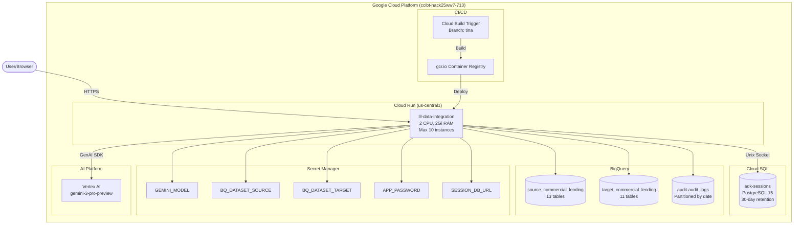

# AIMagna Data Integration Agent - Architecture & Design

Comprehensive technical documentation for the multi-agent data integration service built with Google ADK, BigQuery, and Vertex AI.

---

## Overview

AIMagna is an AI-powered data integration system that reduces data onboarding time from weeks to hours through intelligent schema mapping and automated transformation generation. The system uses a multi-agent architecture where specialized AI agents collaborate to analyze schemas, propose mappings, generate SQL transformations, and execute data migrations with comprehensive guardrails and audit trails.

---

## Table of Contents

1. [Agent Architecture](#agent-architecture)
2. [Design Rationale](#design-rationale)
3. [Workflow](#workflow)
4. [Tools & Guardrails](#tools--guardrails)
5. [Deployment Architecture](#deployment-architecture)
6. [Technical Stack](#technical-stack)

---

## Agent Architecture

### Multi-Agent Design


### Agent Roles

| Agent | Purpose | Key Capabilities |
|-------|---------|-----------------|
| **Data Integration Coordinator** | Orchestrates workflow, routes tasks to specialized agents | - Understands user intent<br>- Delegates to appropriate sub-agent<br>- Summarizes results<br>- Guides users through workflow |
| **Schema Analyzer** | Analyzes source and target database schemas | - Retrieves BigQuery schema metadata<br>- Identifies tables, columns, data types<br>- Stores schema in session state |
| **Mapping Agent** | Discovers column mappings with confidence scoring | - Name-based mapping suggestions<br>- Type compatibility analysis<br>- Confidence scoring (0-100%)<br>- Human approval workflow<br>- Explainability for each mapping |
| **Transformation Agent** | Generates and executes SQL transformations | - SQL generation with inline comments<br>- Dry-run validation<br>- Two-phase execution (token-based)<br>- Risk assessment |
| **Audit Logs Agent** | Provides audit trail visibility | - Query BigQuery audit table<br>- Filter by event type, risk level, date<br>- Compliance reporting |

---

## Design Rationale

### Why Multi-Agent Architecture?

The multi-agent architecture was chosen over a monolithic approach for several critical reasons:

#### 1. **Separation of Concerns**
Each agent has a focused responsibility:
- **Schema Analyzer** understands data structures
- **Mapping Agent** handles the complex logic of column matching and confidence scoring
- **Transformation Agent** manages SQL generation and execution safety
- **Audit Agent** provides compliance and visibility

This separation makes the system easier to maintain, test, and extend.

#### 2. **Specialized Context & Expertise**
Each agent is equipped with:
- **Specific tools** relevant to its domain
- **Specialized instructions** and few-shot examples
- **Domain-specific vocabulary** for better LLM performance

For example, the Mapping Agent has detailed examples of high/medium/low confidence mappings with reasoning, while the Transformation Agent has SQL generation examples with risk warnings.

#### 3. **Controlled State Sharing**
Agents communicate via **session state** (`tool_context.state`):
- Schema Analyzer stores `source_schema` and `target_schema`
- Mapping Agent stores `suggested_mappings` and `approved_mappings`
- Transformation Agent reads approved mappings to generate SQL

This prevents context pollution and keeps each agent's scope clear.

#### 4. **Human-in-the-Loop Checkpoints**
The workflow includes natural approval gates:
- Users review mapping suggestions before approval
- Dry-run validation before SQL execution
- Token-based confirmation for destructive operations

Multi-agent architecture makes these checkpoints explicit in the workflow.

#### 5. **Scalability & Extensibility**
New capabilities can be added by:
- Creating new specialized agents (e.g., Data Quality Agent, Schema Evolution Agent)
- Adding tools to existing agents
- Extending guardrails without changing agent logic

#### 6. **Risk Mitigation**
Isolating SQL execution in the Transformation Agent with strict guardrails:
- SQL injection prevention at the tool layer
- Mapping hallucination detection prevents invalid column references
- Audit logging tracks all high-risk operations

---

## Workflow

### End-to-End Data Integration Sequence


### Workflow Steps

1. **Schema Analysis**
   - User requests analysis of source and target datasets
   - Schema Analyzer retrieves table and column metadata from BigQuery
   - Results stored in session state for other agents

2. **Mapping Discovery**
   - User specifies source → target table pair
   - Mapping Agent analyzes column names and types
   - Generates confidence scores (0-100%) based on:
     - Name similarity (exact, partial, semantic)
     - Type compatibility
     - Nullability constraints
   - Validates mappings to prevent hallucinations
   - Provides human-readable explanations

3. **Human Approval**
   - User reviews proposed mappings
   - Can request changes or approve
   - Approved mappings stored in session state

4. **SQL Generation**
   - Transformation Agent reads approved mappings
   - Generates INSERT statement with:
     - Type conversions where needed
     - Inline comments explaining transformations
     - Risk warnings for lossy conversions

5. **Dry-Run Validation**
   - SQL executed with BigQuery dry-run API
   - Validates syntax and permissions
   - Returns execution token for confirmation

6. **Execution**
   - User confirms with execution token
   - SQL executed against BigQuery
   - Audit log records operation with job ID

---

## Tools & Guardrails

### Tool Layer (`data_integration_agent/tools.py`)

| Tool | Purpose | Guardrails |
|------|---------|------------|
| `get_source_schema` | Retrieve source schema from BigQuery | - Identifier validation<br>- Audit logging |
| `get_target_schema` | Retrieve target schema from BigQuery | - Identifier validation<br>- Audit logging |
| `suggest_column_mappings` | Generate mapping proposals with confidence | - Hallucination detection<br>- Confidence thresholds<br>- Explainability<br>- Risk assessment |
| `approve_mappings` | Record human approval/rejection | - Decision validation<br>- Risk assessment<br>- Audit logging |
| `generate_transformation_sql` | Create SQL transformation | - SQL injection prevention<br>- Approved mappings check<br>- Validation<br>- Audit logging |
| `execute_transformation` | Execute SQL (dry-run or live) | - SQL injection prevention<br>- Token-based confirmation<br>- Dry-run enforcement<br>- Audit logging (HIGH risk) |
| `get_audit_logs` | Query audit trail | - Date range validation<br>- Filter validation |

### Guardrails Layer (`data_integration_agent/guardrails.py`)

#### 1. **Input Validation**
- **SQL Injection Prevention**: Regex patterns block dangerous SQL keywords
- **Identifier Validation**: Table/column names must match `^[a-zA-Z_][a-zA-Z0-9_]*$`
- **Query Validation**: Checks for unsafe patterns before BigQuery execution

#### 2. **Output Validation**
- **Mapping Hallucination Detection**: Validates that source/target columns exist in actual schemas
- **Confidence Thresholds**: 
  - HIGH (>80%): Approved automatically with explanation
  - MEDIUM (50-80%): Requires review
  - LOW (<50%): Requires human confirmation

#### 3. **Audit Logging**
All operations logged to BigQuery (`{project}.audit.audit_logs`):

```sql
CREATE TABLE audit_logs (
  timestamp TIMESTAMP,
  event_type STRING,  -- SCHEMA_ACCESS, MAPPING, SQL_EXECUTION, SECURITY
  action STRING,      -- Specific action taken
  user_id STRING,
  risk_level STRING,  -- LOW, MEDIUM, HIGH, CRITICAL
  details JSON,       -- Event-specific context
  retention_days INT  -- Auto-cleanup policy
)
PARTITION BY DATE(timestamp);
```

**Retention Policy**:
- LOW/MEDIUM: 30 days
- HIGH: 90 days
- CRITICAL: 365 days

#### 4. **Risk Assessment**
Each operation assigned a risk level:
- **LOW**: Schema reads, mapping suggestions
- **MEDIUM**: Type conversions, semantic mappings
- **HIGH**: SQL execution, data modifications
- **CRITICAL**: Multi-table transformations, bulk deletes

#### 5. **Explainability**
Every mapping includes:
- **Confidence score** with reasoning
- **Transformation** description (if applicable)
- **Risk level** with mitigation suggestions
- **Recommendation** for next steps

Example:
```
Source: loan.loan_amt (FLOAT64) → Target: dim_loan.original_loan_amount (NUMERIC)
Confidence: 72%
Reasoning: "Semantic similarity ('amt' means 'amount'). Type conversion required."
Risk: MEDIUM - FLOAT64 to NUMERIC may lose precision for very large numbers.
Transformation: CAST(loan_amt AS NUMERIC)
Recommendation: "Verify max values don't exceed NUMERIC(38,9) precision limits"
```

---

## Deployment Architecture

### GCP Infrastructure



### Deployed Resources

#### Cloud Run Service
| Property | Value |
|----------|-------|
| **Service Name** | `lll-data-integration` |
| **URL** | https://lll-data-integration-417355809300.us-central1.run.app |
| **Region** | us-central1 |
| **Image** | `gcr.io/ccibt-hack25ww7-713/lll-data-integration:latest` |
| **Memory** | 2Gi |
| **CPU** | 2 |
| **Timeout** | 300s |
| **Min Instances** | 0 |
| **Max Instances** | 10 |
| **Authentication** | Allow unauthenticated (app-level password via `APP_PASSWORD`) |
| **Service Account** | `417355809300-compute@developer.gserviceaccount.com` |

**Console**: https://console.cloud.google.com/run?project=ccibt-hack25ww7-713

#### Cloud SQL Instance
| Property | Value |
|----------|-------|
| **Instance Name** | `adk-sessions` |
| **Database** | PostgreSQL 15 |
| **Connection** | `ccibt-hack25ww7-713:us-central1:adk-sessions` |
| **Purpose** | Session persistence (30-day retention) |
| **Table** | `adk_sessions` (managed by ADK DatabaseSessionService) |

**Console**: https://console.cloud.google.com/sql/instances/adk-sessions/overview?project=ccibt-hack25ww7-713

**Connection Format**:
```
postgresql+asyncpg://adk_user:adk_password@/adk_sessions?host=/cloudsql/ccibt-hack25ww7-713:us-central1:adk-sessions
```

#### BigQuery Datasets
| Dataset | Purpose | Tables | Console |
|---------|---------|--------|---------|
| `source_commercial_lending` | Source data | 13 tables (borrower, loan, facility, payment, collateral, guarantor, covenant, rate_index, rate_index_history, risk_rating, syndicate_member, syndicate_participation) | [Open](https://console.cloud.google.com/bigquery?project=ccibt-hack25ww7-713&d=source_commercial_lending) |
| `target_commercial_lending` | Target schema | 11 tables (dim_borrower, dim_loan, dim_facility, dim_collateral, dim_guarantor, dim_rate_index, dim_risk_rating, dim_syndicate_member, dim_date, fact_payments, fact_loan_snapshot) | [Open](https://console.cloud.google.com/bigquery?project=ccibt-hack25ww7-713&d=target_commercial_lending) |
| `audit` | Audit logs | `audit_logs` (partitioned by date) | [Open](https://console.cloud.google.com/bigquery?project=ccibt-hack25ww7-713&d=audit) |

#### CI/CD Pipeline
| Component | Configuration |
|-----------|--------------|
| **Trigger Name** | `lll-data-integration-cicd` |
| **Source** | GitHub `Tinak123/aimagna-tina` |
| **Branch** | `tina` |
| **Build File** | `cloudbuild.yaml` |
| **Build Steps** | 1. Docker build<br>2. Push to gcr.io<br>3. Deploy to Cloud Run |
| **Machine Type** | E2_HIGHCPU_8 |
| **Timeout** | 1200s (20 minutes) |

**Console**: https://console.cloud.google.com/cloud-build/triggers?project=ccibt-hack25ww7-713

### Environment Configuration

Environment variables are injected via **Secret Manager** in Cloud Run:

| Secret | Purpose | Code Default |
|--------|---------|--------------|
| `GOOGLE_CLOUD_PROJECT` | GCP project ID | - |
| `GOOGLE_CLOUD_LOCATION` | Region for Vertex AI | `global` |
| `GOOGLE_GENAI_USE_VERTEXAI` | Enable Vertex AI | `true` |
| `BQ_PROJECT_ID` | BigQuery project | Same as `GOOGLE_CLOUD_PROJECT` |
| `BQ_DATASET_SOURCE` | Source dataset name | `commercial_lending_source` |
| `BQ_DATASET_TARGET` | Target dataset name | `commercial_lending_target` |
| `BQ_AUDIT_DATASET` | Audit dataset name | `audit` |
| `BQ_AUDIT_TABLE` | Audit table name | `audit_logs` |
| `GEMINI_MODEL` | LLM model name | `gemini-3-pro-preview` |
| `APP_PASSWORD` | Web UI authentication | - |
| `SESSION_DB_URL` | Cloud SQL connection string | Falls back to in-memory sessions |

### Local Development

For local Docker development, the agent falls back to:
- **In-memory sessions** (if `SESSION_DB_URL` not set)
- **Local credentials** (mounted from `~/.config/gcloud`)

Run locally:
```powershell
# Build
docker build -t lll-data-integration:latest -f data_integration_agent/Dockerfile data_integration_agent

# Run (with Cloud SQL)
docker run -d --name lll-agent -p 8080:8080 \
  -v "$env:APPDATA/gcloud:/root/.config/gcloud:ro" \
  -e GOOGLE_APPLICATION_CREDENTIALS=/root/.config/gcloud/application_default_credentials.json \
  -e GOOGLE_CLOUD_PROJECT=ccibt-hack25ww7-713 \
  -e SESSION_DB_URL='postgresql+asyncpg://...' \
  lll-data-integration:latest
```

**Note**: Local Docker with Cloud SQL requires `cloud-sql-proxy` running or the container will fall back to in-memory sessions.

---

## Technical Stack

### Core Technologies

| Component | Technology | Version | Purpose |
|-----------|------------|---------|---------|
| **Agent Framework** | Google ADK | Latest | Multi-agent orchestration, tool calling, session management |
| **LLM** | Gemini 3 Pro (Preview) | - | Natural language understanding, code generation |
| **AI Platform** | Vertex AI | - | LLM inference with enterprise controls |
| **Data Warehouse** | BigQuery | - | Schema storage, data transformation, audit logs |
| **Session Store** | Cloud SQL (PostgreSQL) | 15 | Persistent session storage (30-day retention) |
| **Container** | Docker | - | Containerized deployment |
| **Hosting** | Cloud Run | Gen 2 | Serverless container hosting with auto-scaling |
| **CI/CD** | Cloud Build | - | Automated build and deployment |
| **Secrets** | Secret Manager | - | Secure configuration management |
| **Version Control** | GitHub | - | Source code repository |

### Python Dependencies

```
google-adk           # Agent Development Kit
google-genai         # Gemini API client
google-cloud-bigquery  # BigQuery client
sqlalchemy          # ORM for session storage
asyncpg             # Async PostgreSQL driver
cloud-sql-python-connector[asyncpg]  # Cloud SQL connectivity
python-dotenv       # Environment variable management
```

### File Structure

```
data_integration_agent/
├── agent.py              # Agent definitions (coordinator + 4 sub-agents)
├── tools.py              # Tool implementations (7 BigQuery operations)
├── guardrails.py         # Validation, audit logging, risk controls
├── server.py             # ADK web server with password authentication
├── session_config.py     # Cloud SQL / in-memory session configuration
├── Dockerfile            # Multi-stage container build
└── requirements.txt      # Python dependencies

docs/
├── architecture.md       # This file
└── demo-script.md        # Demo walkthrough

scripts/
├── deploy.ps1            # PowerShell deployment script
└── sync-secrets.ps1      # Secret Manager sync script

cloudbuild.yaml           # Cloud Build CI/CD configuration
trigger-config.yaml       # Cloud Build trigger configuration
```

### API Endpoints

The ADK server exposes:

| Endpoint | Purpose |
|----------|---------|
| `GET /` | Health check / redirect to dev UI |
| `GET /dev-ui/` | ADK Developer UI (chat interface) |
| `POST /dev-ui/run_sse` | Server-sent events for agent streaming |
| `GET /dev-ui/apps/{app}/users/{user}/sessions` | List sessions |
| `POST /dev-ui/apps/{app}/users/{user}/sessions` | Create new session |
| `GET /dev-ui/debug/trace/{event_id}` | Agent execution trace |

**Authentication**: All endpoints protected by `APP_PASSWORD` (configurable via env var).

---

## Verification Commands

```bash
# Check Cloud Run status
gcloud run services describe lll-data-integration \
  --project=ccibt-hack25ww7-713 \
  --region=us-central1

# Check Cloud SQL instance
gcloud sql instances describe adk-sessions \
  --project=ccibt-hack25ww7-713

# Check BigQuery datasets
bq ls --project_id=ccibt-hack25ww7-713 source_commercial_lending
bq ls --project_id=ccibt-hack25ww7-713 target_commercial_lending
bq ls --project_id=ccibt-hack25ww7-713 audit

# Check Cloud Build triggers
gcloud builds triggers describe lll-data-integration-cicd \
  --project=ccibt-hack25ww7-713

# View recent builds
gcloud builds list --limit=5 --project=ccibt-hack25ww7-713

# View Cloud Run logs
gcloud run services logs read lll-data-integration \
  --region=us-central1 \
  --limit=50 \
  --project=ccibt-hack25ww7-713
```

---

## Summary

AIMagna demonstrates enterprise-grade AI agent design with:
- **Clear separation of concerns** via specialized agents
- **Robust guardrails** preventing hallucinations and SQL injection
- **Comprehensive audit trails** for compliance and debugging
- **Human-in-the-loop** approval workflows for critical operations
- **Cloud-native architecture** with auto-scaling and managed services
- **CI/CD automation** for rapid iteration

The multi-agent approach enables complexity management, extensibility, and safety controls that would be difficult to achieve with a monolithic design.
